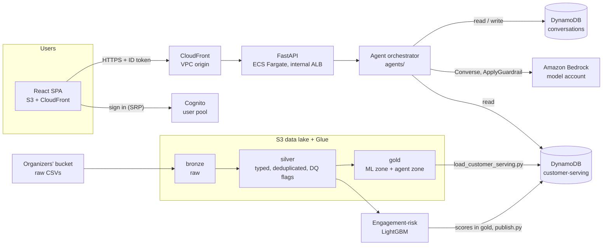

# Cuy Loyalty

A loyalty assistant for LATAM Bank customers, built for the Factored Hackathon 2026. Customers sign in and chat
in Spanish or Portuguese with an assistant that answers questions about their own products, spending, campaigns,
complaints, branches and exchange rates. It recommends a loyalty benefit chosen by a machine-learning
engagement-risk model and hands the conversation to a human when it should not answer by itself.

Behind the chat sit a medallion data lake with data-quality checks on the bank's 13 source tables, a LightGBM
model that scores every customer, and a FastAPI backend that runs the agent on Amazon Bedrock with guardrails. All
of it is deployed on AWS with Terraform.

## Contents

- [Features](#features)
- [Architecture](#architecture)
- [Feature details](#feature-details)
  - [Data platform](#data-platform)
  - [Engagement-risk model](#engagement-risk-model)
  - [Loyalty assistant](#loyalty-assistant)
  - [Backend API](#backend-api)
  - [Web app](#web-app)
  - [Infrastructure](#infrastructure)
  - [Evaluation and observability](#evaluation-and-observability)
- [Repository layout](#repository-layout)
- [Running locally](#running-locally)
- [Tests](#tests)
- [Operational scripts](#operational-scripts)
- [Documentation](#documentation)
- [Known limitations](#known-limitations)

## Features

| Area | What it does |
| --- | --- |
| **Chat assistant** | Authenticated chat in Spanish and Portuguese. The assistant answers from the signed-in customer's own data through 11 customer-scoped tools. |
| **ML loyalty recommendations** | A LightGBM engagement-risk score picks a loyalty strategy (retention, win-back, onboarding, etc.), and a fixed catalogue picks an illustrative benefit for it. The LLM only puts the benefit into words. |
| **Human handoff** | The assistant escalates when the customer asks for a human, when a credit or eligibility decision is needed, or after two failed turns in a row. The handoff carries a redacted transcript for the human agent. |
| **Safety and privacy** | Identity comes only from the verified Cognito token. PII is masked when gold is built, and the backend reads only the serving copy of the agent zone. The Bedrock guardrail checks input and output, a deterministic scan catches long digit runs, and credit-score and income questions get fixed policy replies. |
| **Data platform** | S3 medallion lake (bronze → silver → gold) built by Glue jobs. It enforces schemas, deduplicates, checks 24 foreign keys, validates Pandera contracts, reports late arrivals and volumes, and gathers every check in an Athena `dq_summary` view. |
| **Serving layer** | The agent zone and the ML scores are published to a DynamoDB single-table store, so each chat turn reads only one customer's data. |
| **Conversation memory** | Sessions, turns and handoffs are stored in DynamoDB with an idle timeout, TTLs and optimistic concurrency. |
| **Cloud deployment** | React SPA on S3 + CloudFront. FastAPI on ECS Fargate behind an internal ALB, reached through CloudFront. Cognito handles sign-in. Bedrock runs in a separate model account. |
| **Evaluation** | Labelled suites for routing, guardrails and grounded inquiry answers, with versioned reports and a run-to-run comparison tool. |
| **Observability** | One structured JSON log line per chat turn feeds CloudWatch metrics and a chat dashboard. The model account has its own Bedrock dashboard. |

## Architecture



**One chat turn** (`agents/orchestrator.py`):

1. The backend verifies the Cognito ID token and takes `customer_id` from its `custom:customer_id` claim. The
   request body can never set it.
2. The orchestrator loads the session: language, failure count and the latest 20 messages.
3. The Bedrock input guardrail screens the message.
4. A router picks an engine (`inquiry`, `recommendation`, `escalation`, `out_of_scope`) and detects the language.
5. Deterministic rules run before any model: credit decisions and requests for a human go to a human, and credit
   score or income questions get a fixed reply.
6. The chosen engine runs.
7. The output scan and the output guardrail screen the reply.
8. The orchestrator counts failures (two in a row hand off) and saves the turn, but only if no other request
   changed the session since step 2.

Read [docs/architecture.md](docs/architecture.md) for the key design decisions.

## Feature details

### Data platform

Code: [data/pipelines/](data/pipelines/README.md). Contracts: [docs/data-contracts.md](docs/data-contracts.md).

- **Ingestion.** [scripts/ingest_to_bronze.sh](scripts/ingest_to_bronze.sh) copies the 13 raw tables from the
  organizers' bucket into `bronze/<table>/ingest_date=<date>/`. The tables are customers, products, branches,
  service agents, campaigns, campaign sends, transactions, call-center interactions, transcripts, surveys,
  digital events, complaints and daily exchange rates.
- **Bronze → silver** (`glue/bronze_to_silver.py`):
  - Schemas are enforced: every file must have the data dictionary's exact header.
  - Silver is typed Parquet with one row per primary key. When a key repeats, the same row always wins, and
    `dq_copies` / `dq_versions` record the duplicates.
  - Silver never drops a row for quality. Each broken rule sets a `dq_invalid_<rule>` flag, and every row gets
    `dq_reasons` and `dq_is_valid`.
  - All 24 foreign keys in the dictionary are checked. The job fails above 5 % orphans and warns above 1 %.
  - Table-specific rules (`table_rules.py`) add flags, imputations marked with `<column>_imputed`, and derived
    columns.
  - Pandera contracts per table (`contracts.py`) check required fields, allowed values, ranges, dates inside the
    dataset and date order.
  - Late arrivals and volumes only warn. Silver adds each event's business date and arrival lag, and the reports
    list missing days, unusual volumes and row counts against the dictionary.
- **Silver → gold** (`glue/silver_to_gold.py`) builds two zones:
  - **ML zone** `gold/`: `customer_features`, `product_catalog`, `fx_daily`, plus `_exclusions`, a count of the
    rows left out and why.
  - **Agent zone** `gold/agent/`: `customer_360`, `campaigns`, `transactions_recent`, `contacts_recent`,
    `complaints`, `branches`, `fx_latest`. Email, phone and product numbers are masked. Backend-only columns are
    prefixed `bk_`. Sensitive columns (credit score, income, age, days past due) are never present, and an
    integration test enforces this (`AGENT_FORBIDDEN`).
- **Data-quality reporting.** Every report is a Glue table. The Athena view `dq_summary` shows every check of every
  table's latest run in one shape.
- **Serving.** `serving/load_customer_serving.py` copies an allow-list of agent-zone columns into the DynamoDB
  `customer-serving` table, keyed `PK = CUST#<id>` with record-type sort keys (`PROFILE`, `TXN#…`, `CONTACT#…`,
  `COMPLAINT#…`, `CAMPAIGN#…`). Branches and FX rates are reference partitions.
- The Glue jobs run unchanged on AWS Glue 5.0 (Spark 3.5) and locally against a folder.

### Engagement-risk model

Code: [ml/engagement_risk/](ml/engagement_risk/). Write-up: [docs/ml/engagement_risk_model.md](docs/ml/engagement_risk_model.md).
Research: [notebooks/](notebooks/).

- **Target.** The model predicts whether a customer will make fewer than 2 eligible transactions in the next 90 days
  (`low_engagement_next_90d`). It uses 26 point-in-time features and quarterly snapshots, with a chronological
  train / validation / test split.
- **Result on the untouched test snapshot.** LightGBM reaches PR-AUC 0.656 and ROC-AUC 0.769. Targeting the
  riskiest 20 % of customers reaches 36.7 % of the customers who disengage, against 29.9 % for the best hand-made
  recency + frequency rule. Of the customers it targets, 72 % really disengage, against a 39 % base rate
  (lift 1.83).
- **Pipeline**, all run from the repo root:
  - `train`: final fit with frozen parameters. A replication guard must reproduce the notebook's validation scores
    before anything is saved, and the model file is byte-identical across runs. Artifacts go to the artifacts bucket.
  - `score`: one row per customer in `gold.engagement_risk_scores`, partitioned by `as_of_date`. Tiers are
    `high` / `medium` / `low`. Customers outside the model's population get a deterministic fallback tier and a
    reason code, with no invented probability: no activity in a year (`high`), new customer (`new_customer`) or
    insufficient data (`unknown`).
  - `publish`: writes one `SK = ENGAGEMENT_RISK` item per customer to the serving table and reads every item back
    to verify it.
- **Category-affinity ranker** (`notebooks/category_affinity_ranker_v1.ipynb`). The notebook found that a
  customer's next spending category carries no signal beyond overall popularity, so this ranker was not put into
  production. Instead, benefits are personalised with the customer's top spending category of the last 90 days.

### Loyalty assistant

Code: [agents/](agents/README.md). The package has no web framework dependency, and the backend is its only caller.

**Routing.** The default `RuleBasedRouter` works without any model. With `AGENT_ROUTER=bedrock`, the
`HybridRouter` uses Claude Haiku 4.5 structured output and still applies the deterministic checks on top. It falls
back to the rules if the model fails.

**Engines**

| Engine | Behaviour |
| --- | --- |
| `inquiry` | A Pydantic AI agent with customer-scoped tools and at most 3 model rounds. It runs on Claude Haiku 4.5, with an optional Sonnet 4.6 fallback. With `AGENT_LLM=local` it uses a deterministic stand-in model. |
| `recommendation` | Engagement-risk item → deterministic strategy → illustrative benefit from a fixed catalogue → presenter. The LLM presenter's reply is replaced by a reviewed template if it adds digits, money or risk language. The model never sees the score, tier or reason. |
| `escalation` | Creates a `Handoff` record with the open question, the opening message, recent turns and verified facts, all redacted, and replies with a fixed acknowledgement. |
| `out_of_scope` | Fixed reply. |

**Tools** (`agents/inquiry_agent.py`, `agents/tools.py`). None of them takes a customer parameter. Each reads the
customer from the run context, so the model cannot ask for another person's data.

| Tool | Returns |
| --- | --- |
| `get_my_profile` | Name, city, state and country |
| `get_my_products` | Products with masked numbers, balances, limits, status |
| `get_my_agent` | The service agent of the customer's latest contact |
| `get_my_spending` | The last 90 days of spending in USD: totals, foreign transactions, by category |
| `get_my_transactions` | Latest transactions, declined ones with a reason |
| `get_my_campaigns` | Campaigns running on the as-of date |
| `get_my_contacts` | Recent call-center contacts |
| `get_my_complaints` | Complaints and their status |
| `get_branch_info` | Branches in a city, by default the customer's own |
| `get_exchange_rate` | Buy and sell rates for a currency pair |
| `recommend_benefit` | The customer's loyalty benefit, from the recommendation flow above |

**Safety layers**

- The customer's identity comes from the verified ID token only. The chat request schema rejects unknown fields
  such as `customer_id`.
- Tool results never contain keys, `customer_id` or `bk_` fields (`tools.public`). A tool with no data says so
  and invents nothing.
- The Bedrock guardrail (Standard tier, Spanish and Portuguese) has content filters, a prompt-attack filter on
  input, denied topics (asset buy/sell advice, taxes and litigation, evading controls), and blocks card numbers,
  CVV, PIN and IBAN. If the guardrail can't be reached, the turn is blocked.
- An output scan (`safety.scan_output`) blocks any reply with 8 or more digits in a row, which could be a full card,
  account or document number. Stored turns are redacted.
- Credit or eligibility decisions always go to a human. Credit score and income questions get a reviewed policy
  reply.

**Sessions and handoffs** (`agents/sessions.py`, `agents/conversations.py`)

- Stores can be in-memory or the DynamoDB `conversations` table. A session's keys always include the verified
  `customer_id`.
- A pause longer than `SESSION_IDLE_MINUTES` (10) starts a new conversation. TTLs keep sessions 7 days and handoffs
  30 days.
- A concurrent write to the same session returns `409`, so a double submit can never overwrite a turn.
- [scripts/handoffs.py](scripts/handoffs.py) prints pending handoffs as transcripts for a human agent.

### Backend API

Code: [backend/](backend/README.md). FastAPI, configured from environment variables or the repo-root `.env`.

| Route | Auth | Purpose |
| --- | --- | --- |
| `GET /health` | none | Liveness check for the load balancer and ECS |
| `GET /me` | Cognito ID token | The signed-in user's identity |
| `GET /me/profile` | Cognito ID token | The customer's profile, from the same serving record the agent reads |
| `POST /chat` | Cognito ID token | One assistant turn: `message`, optional `session_id` and `language` |

- The backend checks each token's signature against the user pool JWKS (cached), along with `iss`, `exp`, `aud`
  and `token_use`. A token without `custom:customer_id` gets `403`.
- Every chat turn logs one `chat_turn` JSON line with the engine, route, tools, tokens, models, fallback use and
  per-stage latency. The line never holds the message, the reply or the customer ID.
- The Docker image (`backend/Dockerfile`) installs runtime dependencies only and runs as a non-root user. It exits
  at startup if the Cognito settings are missing.

### Web app

Code: [frontend/](frontend/README.md). Built with React 19, Vite, TypeScript, Tailwind CSS v4 and Amplify Auth.

- A login page with Cognito email + password (SRP). Amplify keeps and refreshes the tokens.
- `/chat` requires a signed-in session and survives a page refresh. Each user has their own conversation state,
  which is cleared when they sign out.
- The UI is in Spanish and Portuguese. A header button switches the language, the choice is remembered, and it is
  sent to the backend as a hint.
- Typing indicator, message length limit, and clear errors for an expired session, an unlinked account, network
  problems and server errors.

### Infrastructure

Code: [infrastructure/terraform/](infrastructure/terraform/README.md).

| Stack | Contents |
| --- | --- |
| `bootstrap/` | S3 bucket for Terraform state |
| `envs/dev/` | Lake + artifacts buckets, Glue databases, crawler, jobs and workflow, Athena workgroup and `dq_summary`, Cognito, ECR, ECS Fargate service with internal ALB, CloudFront for the API (VPC origin) and the SPA (OAC), DynamoDB tables, CloudWatch chat dashboard |
| `envs/dev-app/` | Bedrock model account: guardrail and published version, `cuy-bedrock-invoker` role trusted by the team account, model invocation logging, Bedrock dashboard |

- **Least privilege.** The backend task role can only read the serving table, read and write the conversations
  table, and assume the Bedrock invoker role. It has no access to the lake.
- **Network.** The API has no public address: CloudFront reaches the internal load balancer through a VPC origin,
  and no NAT gateway is needed.
- **Pausing.** Setting `backend_desired_count=0` stops the app without destroying it.

### Evaluation and observability

Suites: [tests/evaluation/](tests/evaluation/README.md). Reports: [evals/](evals/README.md).

| Suite | Scores |
| --- | --- |
| `routing/rules`, `routing/hybrid` | Engine, language, credit-decision and sensitive-request detection |
| `guardrail/scan`, `guardrail/bedrock`, `guardrail/turn` | Block/allow decisions, which policy intervened, and full turns with the guardrail |
| `inquiry/*` | Six deterministic checks per question, with no judge model: right tools, grounded figures, scoped to the customer, reply language, passes screening, within request budget. Each turn also records tokens, latency and estimated cost. |

- The offline suites run with every `pytest` run. The live suites run only with `EVAL_LIVE=1`, and Bedrock calls
  are paced to the model account's quota.
- `EVAL_REPORT=<name>` saves a run with a snapshot of every lever: prompts, tool schemas, rules, model IDs and the
  guardrail definition. `evals/compare.py` diffs two runs and can fail on regressions.
- The inquiry baseline (2026-10-06) passes 15 of 20 cases, at about $0.08 for the whole suite and a 2.2 s p50
  latency. See [evals/reports/inquiry-baseline.md](evals/reports/inquiry-baseline.md).

## Repository layout

| Path | Contents |
| --- | --- |
| [agents/](agents/README.md) | Orchestrator, routers, engines, tools, guardrails, loyalty policy, session stores |
| [backend/](backend/README.md) | FastAPI app (`backend/app`), Dockerfile |
| [frontend/](frontend/README.md) | React SPA |
| [data/pipelines/](data/pipelines/README.md) | Glue jobs (`glue/`) and the DynamoDB serving loader (`serving/`) |
| [ml/engagement_risk/](ml/engagement_risk/) | Engagement-risk training, batch scoring and publishing |
| [notebooks/](notebooks/) | Research notebooks for the engagement-risk model and the category-affinity ranker |
| [infrastructure/terraform/](infrastructure/terraform/README.md) | Terraform modules and environments |
| [tests/](tests/) | `unit/`, `integration/` (Spark), `evaluation/` |
| [evals/](evals/README.md) | Saved evaluation runs and `compare.py` |
| [scripts/](scripts/) | Ingestion, Bedrock smoke test, handoff viewer |
| [docs/](docs/) | Architecture, data contracts, limitations, ML write-up, UI references |

`infrastructure/helm/`, `ml/baseline/`, `ml/models/`, `ml/evaluation/`, `data/raw/`, `data/processed/` and
`data/schemas/` are placeholders.

## Running locally

**Requirements:** [uv](https://docs.astral.sh/uv/) with Python 3.12+, and Node.js 20.19+ or 22.12+. On macOS,
LightGBM also needs OpenMP (`brew install libomp`).

The app runs without any AWS model access. The defaults are `AGENT_LLM=local` (a deterministic stand-in model),
`AGENT_ROUTER=rules`, and in-memory serving and conversation stores. Only Cognito is required, for sign-in.

```bash
# 1. Configuration: fill in the Cognito values from Terraform
cp .env.example .env
cp frontend/.env.example frontend/.env.local
terraform -chdir=infrastructure/terraform/envs/dev output

# 2. Backend at http://localhost:8000 (docs at /docs)
uv sync
uv run python -m uvicorn app.main:app --app-dir backend --reload --port 8000

# 3. Frontend at http://localhost:5173
cd frontend && npm install && npm run dev
```

Use `python -m uvicorn`: it puts the repo root on the import path, which the backend needs to import `agents/`.

To use real data and models, set these in `.env`. The [backend README](backend/README.md#configuration) lists every
variable.

| Setting | Effect |
| --- | --- |
| `SERVING_BACKEND=dynamodb`, `SERVING_AWS_PROFILE=<team profile>` | Tools read the DynamoDB customer-serving table |
| `CONVERSATIONS_BACKEND=dynamodb`, `CONVERSATIONS_AWS_PROFILE=<team profile>` | Sessions and handoffs persist in DynamoDB |
| `AGENT_LLM=bedrock`, `AGENT_ROUTER=bedrock`, `BEDROCK_PROFILE=<invoker profile>` | Inquiry, routing and benefit wording run on Bedrock |
| `BEDROCK_GUARDRAIL_ID`, `BEDROCK_GUARDRAIL_VERSION` | Every message and reply is checked with the guardrail |

Never put AWS keys in `.env`. Use named profiles locally and the ECS task role when deployed. Sign-in users are
created by an admin, as described in
[infrastructure/terraform/README.md](infrastructure/terraform/README.md#authentication-cognito).

## Tests

| Command | Covers |
| --- | --- |
| `uv run pytest tests/unit` | Agents, backend, serving loader, ML pipeline, scripts. No AWS: Bedrock requests are disabled and AWS credentials are dummies. |
| `uv run pytest tests/evaluation` | Offline evaluation suites. Add `EVAL_LIVE=1` and the Bedrock settings for the live ones. |
| `uv run --no-project --python 3.11 --with-requirements tests/integration/requirements.txt pytest tests/integration` | Both Glue jobs on a small planted lake, run in local Spark |
| `cd frontend && npm test` | Frontend (Vitest + Testing Library) |
| `cd frontend && npm run lint` | Frontend lint (oxlint) |

## Operational scripts

```bash
# Raw data into bronze, then run the Glue workflow
SOURCE_URI=s3://<organizers-bucket>/data LAKE_BUCKET=<lake bucket> ./scripts/ingest_to_bronze.sh
aws glue start-workflow-run --name $(terraform -chdir=infrastructure/terraform/envs/dev output -raw glue_workflow)

# Publish the agent zone to DynamoDB (drop --dry-run to write)
uv run --no-project --with-requirements data/pipelines/serving/requirements.txt \
  python data/pipelines/serving/load_customer_serving.py --profile cuy-loyalty --all --dry-run

# Engagement-risk model: train, score, publish
uv run --group data python -m ml.engagement_risk.train   --profile cuy-loyalty
uv run --group data python -m ml.engagement_risk.score   --profile cuy-loyalty --as-of 2026-06-17
uv run --group data python -m ml.engagement_risk.publish --profile cuy-loyalty --as-of 2026-06-17

# Live Bedrock smoke test (a few requests)
BEDROCK_PROFILE=<profile> uv run python scripts/bedrock_smoke.py

# Pending handoffs as transcripts
uv run python scripts/handoffs.py
```

## Documentation

| Document | Topic |
| --- | --- |
| [docs/architecture.md](docs/architecture.md) | Lake zones, agent-zone isolation, masking, `bk_` columns, fairness |
| [docs/data-contracts.md](docs/data-contracts.md) | Generated per-table contracts: types, required fields, allowed values, ranges |
| [docs/limitations.md](docs/limitations.md) | Source-data defects and how the pipeline handles them |
| [docs/ml/engagement_risk_model.md](docs/ml/engagement_risk_model.md) | Engagement-risk model: target, baselines, results, productionization |
| [data/pipelines/README.md](data/pipelines/README.md) | Glue jobs, data-quality rules, reports, serving loader |
| [agents/README.md](agents/README.md) | Turn flow, module layout, security invariants |
| [backend/README.md](backend/README.md) | Configuration, auth, Bedrock, logging, Docker |
| [frontend/README.md](frontend/README.md) | Commands and Cognito setup |
| [infrastructure/terraform/README.md](infrastructure/terraform/README.md) | Deploy, Cognito users, Bedrock model account |
| [tests/evaluation/README.md](tests/evaluation/README.md), [evals/README.md](evals/README.md) | Evaluation suites, datasets, reports |

## Known limitations

- **Synthetic data with weak signal.** Call transcripts and complaint descriptions are templates, there are no NPS
  promoters, and several declared foreign keys don't match the data. Details: [docs/limitations.md](docs/limitations.md).
- **The risk score is predictive, not causal.** It says who is likely to disengage, not whether a benefit will
  change that.
- **Illustrative benefits.** The data has no real offer catalogue, so every benefit is a demonstration concept and
  is labelled as one to the customer.
- **Handoff queue only.** Handoffs are queued for a human-service workflow, which doesn't exist yet. No human reply
  is simulated.
- **Model-account quota.** The model account allows about 10 Haiku requests a minute, which limits both the live
  evaluations and concurrent chat traffic.
