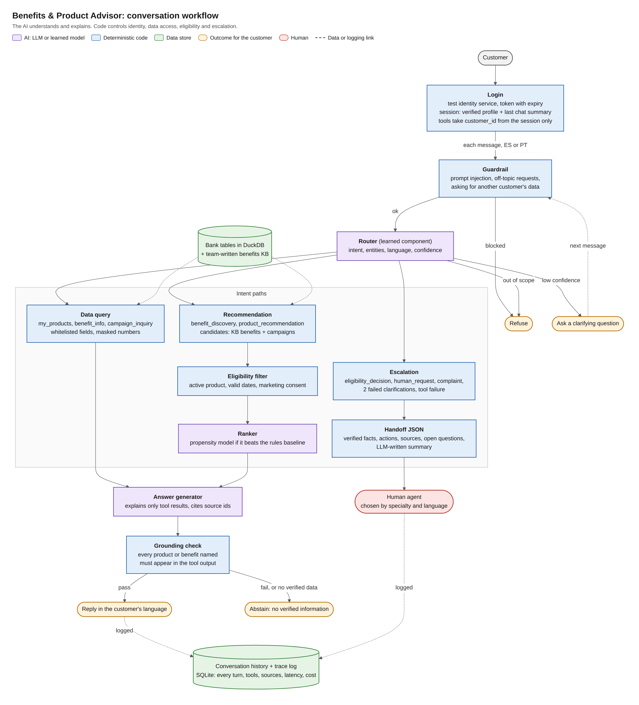
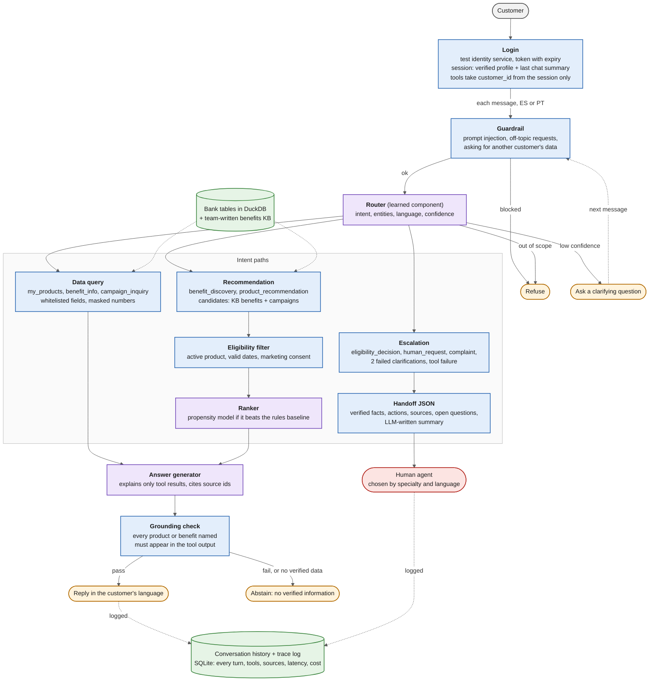

# Workflow design: review of Sergio's proposal

Written 2026-10-01. Responds to Sergio's proposed flow (login, routing agent, three intent agents, conversation history). Data facts cited here come from section 2 of [idea-review.md](idea-review.md).

## Verdict

The shape is right: a context-aware login, a router that clarifies or refuses, specialized paths, and a human handoff. That maps directly to the brief's three required paths (normal, ambiguous or unsupported, human). My changes are mostly about **where the control lives**: the LLM should understand and explain, while login, data access, eligibility and escalation rules stay in code.

## Recommended flow

Purple boxes are AI (an LLM or a learned model), blue boxes are deterministic code, green cylinders are data stores, amber shapes are outcomes for the customer, and red is the human agent. Dotted lines are data or logging links. The image is [workflow-diagram.png](workflow-diagram.png), sized for slides.

Two rules the diagram encodes that are easy to miss:
- Tools never receive `customer_id` from the model; the backend fills it in from the session created at login.
- If a tool finds nothing for the question (for example a benefit that isn't in the KB), the answer is an abstention, not a guess and not a handoff.

Mermaid source (renders on GitHub; edit here and paste into the repo README)

## Step by step

### 0. Login and context

- Authenticate with a simulated identity service that issues a session token with an expiry. The brief explicitly tests expired sessions and says a customer number alone is not proof of identity.
- At login, load only a **small verified profile** into session state: segment, language, active products, `accepts_marketing`, plus a summary of the last conversation. Everything else (spend profile, campaigns received, past contacts) is fetched by tools when needed. That keeps prompts cheap and makes every data access traceable.
- **Tools never take a `customer_id` argument from the model.** The backend injects it from the session. This one design choice is what makes "show me another customer's transactions" impossible no matter what the prompt says, and it's the strongest answer you'll have to the security criteria.
- Don't preload a human agent. Choose the agent at handoff time, based on the reason for escalation.

### 1. UI

Fine as proposed. Detect the language (ES or PT) on the first message and keep it in session state so replies and the handoff queue match it.

### 2. Router

Good idea, with three refinements:

1. **Split the guardrail from the router.** Run a cheap check first for prompt injection, off-topic requests (the Fibonacci example) and attempts to access other customers. Refusals then don't depend on the router getting creative.
2. **The router returns structured JSON**, not prose: `intent`, `entities` (product type, benefit category), `language`, `confidence`. If confidence is below a threshold or a required entity is missing, ask a clarifying question. After two failed clarifications, hand off.
3. **Make the router your learned component.** Evaluate an LLM router against a TF-IDF + logistic regression baseline on a team-written ES/PT utterance set with a held-out split. This works whether or not the propensity check passes, it naturally covers Portuguese, and it's exactly what "evaluate a learned component against a baseline" asks for. The router must see recent turns so it can resolve follow-ups like "¿y con la otra tarjeta?".

Suggested intent list (keep it short):

| Intent | Example | Path |
|---|---|---|
| `my_products` | "¿Qué productos tengo?" | Data query |
| `benefit_info` | "¿Qué beneficios tiene mi tarjeta?" | Data query + KB |
| `benefit_discovery` | "Viajo mucho, ¿qué me sirve?" | Recommendation |
| `product_recommendation` | "¿Qué producto me conviene?" | Recommendation |
| `campaign_inquiry` | "Me llegó una oferta, ¿qué es?" | Data query + KB |
| `eligibility_decision` | "¿Me aprueban un crédito?" | Escalation |
| `human_request` | "Quiero hablar con alguien" | Escalation |
| `out_of_scope` / `unsafe` | Fibonacci, injection | Refuse |

### 3. Intent paths

**Use one orchestrator with intent-specific tool sets, not three independent LLM agents.** The brief says multiple agents are not required, and each extra agent adds latency, cost and failure modes you then have to evaluate. You can still present them as three modules in the architecture slide.

**3.1 Data queries.** Keep it within the workflow: the customer's products, the benefits attached to them, and the campaigns they received. Tools return **whitelisted fields only**. Never expose `credit_score`, `estimated_monthly_income`, `days_past_due`, `fraud_score` or full product numbers (mask them). Transactions should come back as an aggregated spend profile (share by category, foreign spending), not raw rows. Past call-center contacts are better used for the handoff summary than shown to the customer.

**3.2 Recommendation.** Yes, the propensity model fits here, as a **ranker after a deterministic filter**, never as the filter:

1. Candidates: KB benefits for the customer's products, plus campaigns targeting their segment or country.
2. Deterministic filter: customer active, product active, campaign dates valid, `accepts_marketing` true for anything promotional.
3. Rank with the propensity model if the check passed; otherwise rank by a simple rule (segment match + spend-category affinity). Build the rule version first; it's also your baseline.
4. The LLM explains the top 1 to 3 with the reason ("40% of your card spending is on Food") and the source id.

Two data catches:
- Only 3 of the 200 campaigns are `Active` and 172 are `Completed`. Pick a fixed **"as-of" date** inside the data range (when many campaigns were running) and treat that as "today" for the demo, or treat campaigns as product offers rather than live promotions. State the choice in the README.
- If `accepts_marketing` is false (50% of customers), still answer questions about the customer's own benefits, which is service, but don't proactively suggest new products. That's a nice visible guardrail for the demo.

**3.3 Escalation.** Make the triggers deterministic rules, with the LLM only writing the summary:
- explicit request for a human;
- any individual credit or eligibility decision;
- complaints (only 43.6% of Queja contacts are resolved on first contact, so these are a poor fit for automation);
- two failed clarifications, a tool failure, or very negative sentiment.

The handoff is a JSON object: request, verified facts, actions taken, sources, open questions, reason, language. Route by **specialty and language**: `service_agents.specialty` has Ventas, Créditos, Inversiones, Retención and Quejas y Reclamos, and Portuguese conversations go to the 129 agents who speak it. Never route by accent or country of origin.

## What's missing from the proposal

1. **Abstention.** "Do I get free airport transfers?" with no KB entry should get "I don't have verified information on that," not an escalation. This is the brief's "unsupported request" path, and it's distinct from handoff.
2. **Grounding post-check.** After the answer is generated, check in code that every product or benefit it names appears in the tool output. If not, replace it with an abstention. This is cheap and makes "unsafe outcomes" measurable.
3. **Tracing.** Log every turn: intent, confidence, tools called with latency, sources, decision, cost. The brief requires execution records and explicitly says hidden chain-of-thought doesn't count.

## Conversation history

- Store every turn in a small database (SQLite is enough) keyed by customer and session, with the trace attached.
- **Within a session:** the last few turns go into the router and answer prompts.
- **Across sessions:** at login, load a short summary of the previous conversation, not the full transcript. Show past conversations in a UI sidebar the customer can reopen. Recall is a UI feature, not an intent.
- **At handoff:** include the session summary in the JSON so the agent doesn't re-ask.
- Document a retention period (for example 90 days) and that only the customer and the assigned agent can read a conversation. That covers the "data retention" item in the brief.

## Build order for the weekend

1. Session + whitelisted tools + guardrail (Friday): everything else depends on it.
2. Router with the intent list, and the team-written ES/PT utterance set (start writing it Friday).
3. Data-query and escalation paths (deterministic, fast to build).
4. Recommendation with the rule ranker; plug in the propensity model only if the check passed.
5. History, tracing, evaluation harness.
